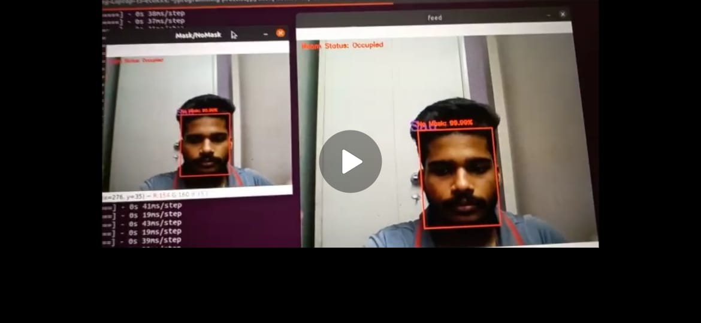
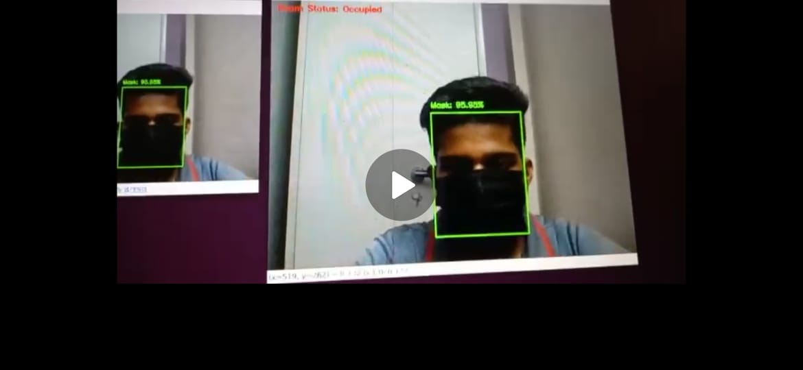
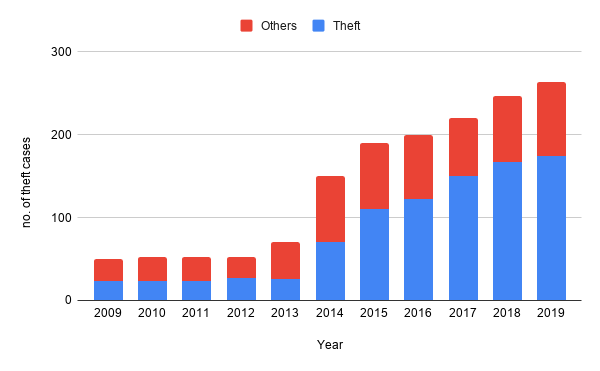

# Theft-Detection 

## DISCLAIMER:
Accuracy of activity captioning is low. You have to work on that!!

### Intruder without mask.

### Intruder with mask.

Theft is the most common crime committed across the world. According to the National Crime Records Bureau (NCRB), ~80% of the criminal cases are related to theft as shown in figure. Increasing theft rates cause people to suffer both financially and emotionally. Therefore, there is a need to develop a more deterrent surveillance system, which is convenient to use, free from false alarms, minimize human interference, and cost-effective.
       

 
 Machine Learning (ML) techniques prove to be fruitful in developing efficient surveillance systems. This paper aims to design a theft detection and monitoring system, which would be capable to detect theft using a motion-sensing camera using ML and alarm the owner with an alert message along with the captured image of that instance of motion. 
 
The system consists of several levels of surveillance at each level the activity in each frame of the video will be monitored thoroughly using ML models, which are solely trained to perform their specific job. There are a total of six levels of surveillance and the system consists of two modes (i.e. day and night) and it will totally depend on the user which mode is required at the moment. 

## Motion Detection: 
To detect the motion we firstly detected if any human being is present in the frame or not and to do so we used CNN. Convolution can be used to achieve the blurring, sharpening, edge detection, noise reduction, which is not easily achieved by other methods.
After getting quite normal results from the model trained on a dataset with 2000 images with a human being and 2000 images without a human being. We tried transfer learning for that we used the YOLOv4 neural network and extracted the weights just before the last two layers of the network and then used those pre-trained weights to train the model which can detect the human being in the image and using the transfer learning technique accuracy got improved. After detecting the human being in the frame we now can detect the motion and so we used python library "OpenCV".
To identify the motion different strategies like frame differencing, background subtraction, optical flow, etc. and got the most excellent comes about with frame differencing. The frame differencing strategy employments the two or three adjacent frames based on time series picture to subtract and gets diverse pictures, its working is exceptionally comparative to background subtraction, after the subtraction of the picture it gives moving target data through the edge esteem. This method is straightforward and simple to execute, conjointly it is comparable to the background subtraction. But this strategy is exceedingly versatile to energetic scene changes; in any case, it by and large falls flat in identifying entirely significant pixels of a few sorts of moving objects. Extra strategies that ought to be received in order to identify ceased objects for the victory of the next level are computationally complex and cannot be utilized in real-time without specialized equipment.

## Mask Detection: 
Thieves usually wear masks to hide their identity while attempting theft. Therefore, the output of this module will help in determining if the theft is real or false. Dataset used in this module is from Google Images and Kaggle. Google images are scraped using the selenium package and Chrome Driver extension. To get better results in a short time the approach Transfer Learning is used and the MobileNetV2 architecture is trained on the weights of ImageNet. Amid training, the main focus was on stacking the face cover detection dataset from disk, training a model (utilizing Keras/TensorFlow) on this dataset, and after that serializing the face mask detector to disk. The model was trained on the information set containing 1000 images for a person with a mask and without a mask each. 
The distinctive steps utilized in this module are: 


Train mask detector: Accepts the input dataset and fine-tunes MobileNetV2 upon it to make  a model. 
Detect mask image: This module performs face mask detection in static images 
Detect mask video: Utilizing the camera, this module applies to confront cover discovery to each frame within the stream. 

For mask detection, we utilized a crossover model in which we, to begin with, recognized the face utilizing haar cascade and after that identified the cover on the face utilizing MobilenetV2 prepared on the weights of the Imagenet. Once the confront veil finder was prepared, we at that point moved on to stacking the mask locator, performing face discovery, and after that classifying each face as ‘with mask’ or ‘ without mask'..

## Facial Expression Detection: 
As a pre-processing step, the images are cropped around the faces and intensity normalized. Features are extracted and local descriptors are calculated. This computation is represented using a Vector of Locally Aggregated Descriptors (VLAD). This labeled dataset is trained on the emotion classes using the SVM classifier. Lastly, the face is identified from the image using a haar cascade classifier and the image is cropped into 256 x 256 resolutions. 

## Weapon Detection: 
Weapon detection is another important module for differentiating between false and actual threats [8]. The approach we have used to detect weapons is similar to that of Mask Detection except that we use a haar cascade to detect the hand of a person and then detect the weapon in the hand. To train the model we used the data set containing 4000 images of person with weapon and person without weapon each. The label of the images employed in the dataset is categorical. Therefore, we used a one-hot encoding to convert the categorical labels to binary values. As our dataset is small, we used augmentation technique to achieve good accuracy. Data augmentation could be a technique that may be used to artificially expand the dimensions of a training dataset by creating modified versions of images within the dataset. Kind of like mask detection, transfer learning is used for training the model. The MobileNetV2 architecture is trained on the weights of ImageNet to realize better accuracy during a short time. During training, callbacks like checkpoints and early stopping are used to save the best-trained model.

## Pose Detection: 
The issue of human posture estimation is frequently characterized since the computer vision strategies that foresee the circumstance of changed human keypoints (joints and points of interest) like elbows, knees, neck, bear, hips, chest, etc. It’s a very challenging issue since different components like little and barely unmistakable parts, occlusions, and huge inconsistency in enunciations. The classical approach to enunciated posture estimation is utilizing the pictorial structures system. The fundamental thought here is to speak to a question by a bunch of "parts" orchestrated in an exceedingly deformable setup (not inflexible). A "portion" is an appearance format that's coordinated in a picture. Springs appear in the spatial associations between parts. When parts are parameterized by pixel area and introduction, the coming about structure can demonstrate verbalization which is uncommonly significant in posture estimation. (A organized expectation assignment). This strategy, be that as it may, comes with the impediment of getting a posture demonstrates not looking at picture information. As a result, inquire has centered on improving the representational control of the models. After getting a few unsuitable results from the above-mentioned strategies inside the final, we utilized a neural organization by Google which gave us the desired results. After getting the posture recognized, we prepared a show that portrays whether the postures recognized in outlines ought to concern approximately suspiciousness inside the outline or not [9]. To do so, we made a fake dataset that contains 10,000 pictures labeled with their postures and a word reference which contains data almost the postures and their pertinence to the sort of action conceivable at that point.

## Activity Captioning: 
Activity captioning is a task similar to image captioning but in real-time that involves computer vision and natural language processing. It takes an image and can describe what’s going on in the image in plain English. This module is essential for determining the course of actions that are being performed by the person in view. In surveillance systems, it can be used to determine theft by captioning the frames obtained from the camera and finally alerting the authorities. We again used the approach of transfer learning by utilizing the ResNet50 architecture trained on the weights of ImageNet. After getting the results from the above six modules those results are combined and then further becomes the input to an ML model which decides to whom it should address for the alert message whether it should be the owner or the cops or both [10].

The main aim of the project is to embed computer vision into a camera. We designed the system in such a way that the camera is connected to an external computer on which the algorithms will run. The client is also connected to this computer through the internet. Whenever suspicious activity is detected an alert message will be sent to the client. The message will consist of an image captured through the camera along with the various features extracted by our 6 modules. We can also use Raspberry Pi instead of a regular computer to reduce the cost of the project.

# Results:
To distinguish the movement we basically utilized the outline differencing method without identifying the human creatures in it which gave great comes about but inevitably, movement get identified indeed by the development of the creepy crawlies or other undesirable things, to expel that commotion we attempted to set a limit nearly same as the alter in pixels to happen due to nearness of a human within the outline. But in this case, moreover, the clamor was tall so in the end we made an ML show that can detect human creatures within the outline. After identifying people within the outline movement is recognized utilizing outline differencing techniques.
In the mask detection module where masks are going to be detected using the ML model, the model was first trained using simple CNN a combination of some convolution layers, max-pooling layers, and some dropout layers followed by dense layers but the accuracy was not up to the mark. Then to improve the accuracy of the model trained on the smaller datasets we used the transfer learning technique and got great results with that. Figure 3 represents the training loss vs. validation loss and training accuracy vs. validation accuracy. We get 90% of validation accuracy in detecting all types of masks on human faces and we get a loss of 3.5%.
In facial expression detection, we primarily developed a model which detects the frontal face of humans present in the frame and then we build another model to determine the facial features using CNN with activation function 'Relu' but we got a poor response with that so we replaced 'Relu' with 'elu' and got great accuracy. 
In weapon detection, we detected the weapons in the image and we used the same technique as of mask detector and achieved good accuracy as shown in figure 4.

In pose detection, we used a model trained by Google to detect the poses and then getting results from that we processed those results to an ML model which detects the poses in the image relates to suspicion or not and to do so we used classification techniques and got best results with multivariate logistic regression.

In activity captioning,  where we designed an ML model which captions the activity is the combination of computer vision and natural language processing and we firstly tried basic image classification and text generation algorithms but didn't get good outcomes then we used transfer learning for image classification and Bert for text generation and eventually we got great results.

Finally after combining the outcomes of these modules the input for another ML model is created which determines to whom the alert message should be sent and to design such a model we used several classification techniques like logistic regression, SVM, etc. But getting the best results with decision trees.

# Conclusion:
The work carried out in this paper is basically centered to plan and create effective and helpful observation frameworks to unravel security issues which are able to offer assistance to reduce/stop a theft. Though a significant amount of research has been done in the past to solve such security problems, it still remains challenging due to increased complexity and various theft actions that are taking place daily. The system will capture images only when there is any human being in the frame and motions exceed a certain threshold that is pre-set in the system. It thus reduces the volume of data that needs to be processed. Also, it will help to save data space by not capturing static images which usually do not contain the object of interest. Users using this system need not worry about supervising the cameras all the time instead the system will inform the user about the activities happening and will also suggest that the user should take some action or not. After successfully implementing the project, it can be applied in a smart home security system which would be very helpful in auto theft detection for security purposes. It can also be useful in banks, museums, and streets at midnight.
